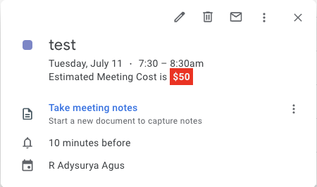

    

    

        <h2> Chrome Extensions for Calculate Meeting Cost</h2>
        <label>in calendar.google.com</label>
    

    

        🚧 UNDERCONSTRUCTION
    

## Usage

- Download this repository content and go to `chrome://extensions` in your chrome browser
- Enable developer mode
- Click `Load unpacked`
- Done
